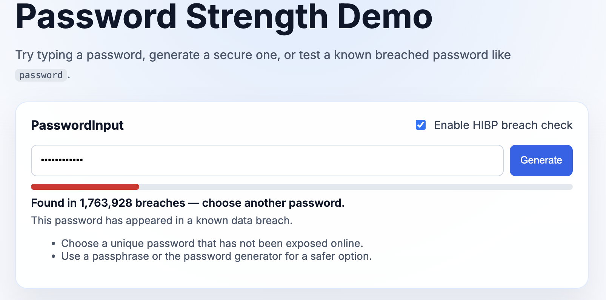
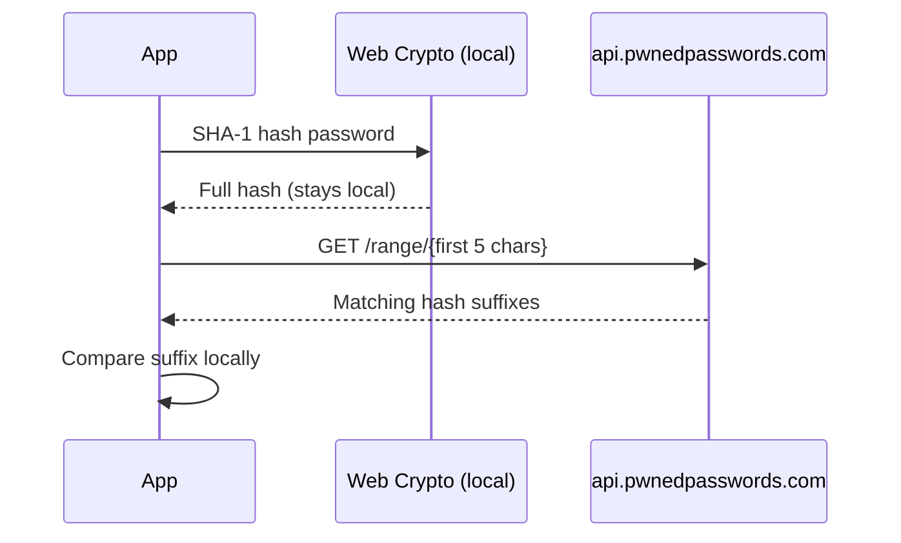

<div align="center">

# Password Strength Checker

**Enterprise-grade password validation for React, Vue, and Angular.**

A modern TypeScript monorepo — v2 of the original 2015 jQuery plugin — with [zxcvbn](https://github.com/dropbox/zxcvbn) entropy scoring, optional [Have I Been Pwned](https://haveibeenpwned.com/) breach detection, and cryptographically secure generation.

<br />

[](LICENSE)
[](https://www.typescriptlang.org/)
[](CHANGELOG.md)
[](https://alenjoy333.github.io/Password-Strength-Checker/)

[Features](#features) · [Packages](#packages) · [Quick Start](#quick-start) · [Live Demo](https://alenjoy333.github.io/Password-Strength-Checker/) · [Privacy](#privacy--hibp) · [Changelog](./CHANGELOG.md)

<br />

<a href="https://alenjoy333.github.io/Password-Strength-Checker/">
  
</a>

<sub><a href="https://alenjoy333.github.io/Password-Strength-Checker/">Open live demo</a> · React sample app in <code>examples/react-demo</code></sub>

</div>

---

## Why Password Strength Checker?

Signup forms deserve better than a colored bar and a regex. This library gives you:

- **Real entropy analysis** — powered by Dropbox's zxcvbn, not naive character-count rules
- **Breach awareness** — optional checks against 850M+ compromised passwords via HIBP k-anonymity
- **Secure generation** — passwords built with `crypto.getRandomValues`, scored before delivery
- **Framework-native UX** — drop-in components and hooks for the stack you already use
- **Small core bundle** — ~7 KB (no embedded password lists; HIBP is opt-in and on-demand)

The original jQuery plugin (v1) is preserved in [`legacy/`](./legacy/) for reference.

---

## Features

| Capability | Details |
|---|---|
| **Entropy scoring** | zxcvbn score 0–4 with crack-time estimates and actionable feedback |
| **Breach detection** | Optional HIBP lookup; only the first 5 SHA-1 hash characters leave the client |
| **Password generator** | Configurable length, charset, and minimum score with CSPRNG |
| **UI components** | Accessible meter, input, and generate button for React, Vue, and Angular |
| **Offline-first** | Instant scoring with zero network calls; breach checks are explicitly opt-in |
| **TypeScript** | Full types across core and all framework packages |

---

## Packages

Built as a monorepo — install only what your stack needs.

| Package | npm | Use case |
|---|---|---|
| [`@pwd-meter/core`](./packages/core) | Framework-agnostic | Analysis, HIBP, generation — use in Node, browsers, or custom UI |
| [`@pwd-meter/react`](./packages/react) | React 18+ | `usePasswordStrength` hook, `PasswordInput`, `PasswordStrengthMeter` |
| [`@pwd-meter/vue`](./packages/vue) | Vue 3.3+ | Composables and SFC components with `v-model` support |
| [`@pwd-meter/angular`](./packages/angular) | Angular 17+ | Standalone service and components (`ps-password-input`) |

```text
@pwd-meter/core          ← zxcvbn · HIBP · generator
        │
        ├── @pwd-meter/react
        ├── @pwd-meter/vue
        └── @pwd-meter/angular
```

---

## Quick Start

### Clone and build (development)

```bash
git clone https://github.com/alenjoy333/Password-Strength-Checker.git
cd Password-Strength-Checker
npm install
npm run build
npm test
```

### Core API

```bash
npm install @pwd-meter/core
```

```ts
import {
  analyzePassword,
  analyzePasswordAsync,
  checkPwnedPassword,
  generateSecurePassword,
} from "@pwd-meter/core";

// Instant offline scoring — no network required
const result = analyzePassword("hunter2");
console.log(result.label, result.score); // "weak", 0

// Optional breach check (HIBP k-anonymity API)
const breached = await analyzePasswordAsync("password123", { checkPwned: true });
console.log(breached.isPwned, breached.pwnedCount); // true, 2262655

// Generate a strong password
const password = generateSecurePassword({ length: 16, minScore: 3 });
```

---

## Framework integration

### React

```bash
npm install @pwd-meter/react @pwd-meter/core
```

```tsx
import { useState } from "react";
import { PasswordInput } from "@pwd-meter/react";
import "@pwd-meter/react/styles.css";

export function SignupForm() {
  const [password, setPassword] = useState("");

  return (
    <PasswordInput
      value={password}
      onChange={setPassword}
      checkPwned
      placeholder="Create a password"
    />
  );
}
```

Use the hook directly for custom UIs:

```tsx
import { usePasswordStrength } from "@pwd-meter/react";

const result = usePasswordStrength(password, { checkPwned: true, debounceMs: 400 });
// result.score · result.label · result.isPwned · result.feedback
```

### Vue

```bash
npm install @pwd-meter/vue @pwd-meter/core
```

```vue
<script setup lang="ts">
import { ref } from "vue";
import { PasswordInput } from "@pwd-meter/vue";
import "@pwd-meter/vue/styles.css";

const password = ref("");
</script>

<template>
  <PasswordInput v-model="password" check-pwned placeholder="Create a password" />
</template>
```

### Angular

```bash
npm install @pwd-meter/angular @pwd-meter/core
```

```ts
import { PasswordInputComponent } from "@pwd-meter/angular";

@Component({
  standalone: true,
  imports: [PasswordInputComponent],
  template: `<ps-password-input [(value)]="password" [checkPwned]="true" />`,
})
export class SignupComponent {
  password = "";
}
```

Import styles in `angular.json` or your global stylesheet:

```css
@import "@pwd-meter/angular/styles.css";
```

---

## Privacy & HIBP

When `checkPwned` is enabled, passwords are verified against the [Pwned Passwords](https://haveibeenpwned.com/Passwords) database using **k-anonymity**. Your users' plain-text passwords never leave the device.



| Step | What happens |
|---|---|
| 1 | Password is hashed with SHA-1 **locally** |
| 2 | Only the **first 5 characters** of the hash are sent to HIBP |
| 3 | HIBP returns hash suffixes for that prefix; your app compares locally |
| 4 | Request **padding** is on by default to reduce fingerprinting |

Breach checks are **opt-in** (`checkPwned` defaults to `false`). Offline zxcvbn scoring always works without a network connection.

```ts
await analyzePasswordAsync("password123", {
  checkPwned: true,
  hibp: {
    timeoutMs: 5000,
    retryCount: 2, // backoff on HTTP 429 / 503
  },
});
```

---

## API reference

### Core exports

| Function | Description |
|---|---|
| `analyzePassword(password)` | Synchronous zxcvbn analysis (offline) |
| `analyzePasswordAsync(password, options?)` | Analysis with optional HIBP check |
| `checkPwnedPassword(password, options?)` | Standalone HIBP k-anonymity lookup |
| `generateSecurePassword(options?)` | CSPRNG password with minimum score |
| `getStrengthColor(label)` | Hex color for meter UI |
| `getStrengthMessage(result)` | Human-readable strength text |

### Result shape

```ts
type PasswordStrengthResult = {
  score: 0 | 1 | 2 | 3 | 4;
  label: "empty" | "weak" | "fair" | "good" | "strong" | "very-strong" | "pwned";
  isPwned: boolean;
  pwnedCount?: number;
  pwnedCheckPending?: boolean;
  crackTimeDisplay: string;
  feedback: { warning?: string; suggestions: string[] };
  checks: { length; lowercase; uppercase; number; symbol };
};
```

---

## Development

```bash
npm install          # install all workspace dependencies
npm run build        # build core → react → vue → angular
npm test             # run core unit tests (Vitest)
npm run clean        # remove dist folders
npm run dev:react    # run the React demo locally
```

### Live demo (GitHub Pages)

The React sample app in `examples/react-demo` deploys automatically on push to `master` via [GitHub Actions](./.github/workflows/deploy-demo.yml).

**Live URL:** [https://alenjoy333.github.io/Password-Strength-Checker/](https://alenjoy333.github.io/Password-Strength-Checker/)

One-time setup in your repo settings:

1. **Settings → Pages → Build and deployment**
2. Set **Source** to **GitHub Actions**

Build locally for Pages:

```bash
npm run build:demo:pages
```

### Publishing

```bash
npm publish -w @pwd-meter/core --access public
npm publish -w @pwd-meter/react --access public
npm publish -w @pwd-meter/vue --access public
npm publish -w @pwd-meter/angular --access public
```

---

## License

MIT © [Alen Joy](https://github.com/alenjoy333)

---

<div align="center">

Built with care as the modern successor to a decade-old jQuery plugin.

If this project helps you ship safer signups, consider starring the repo.

</div>
